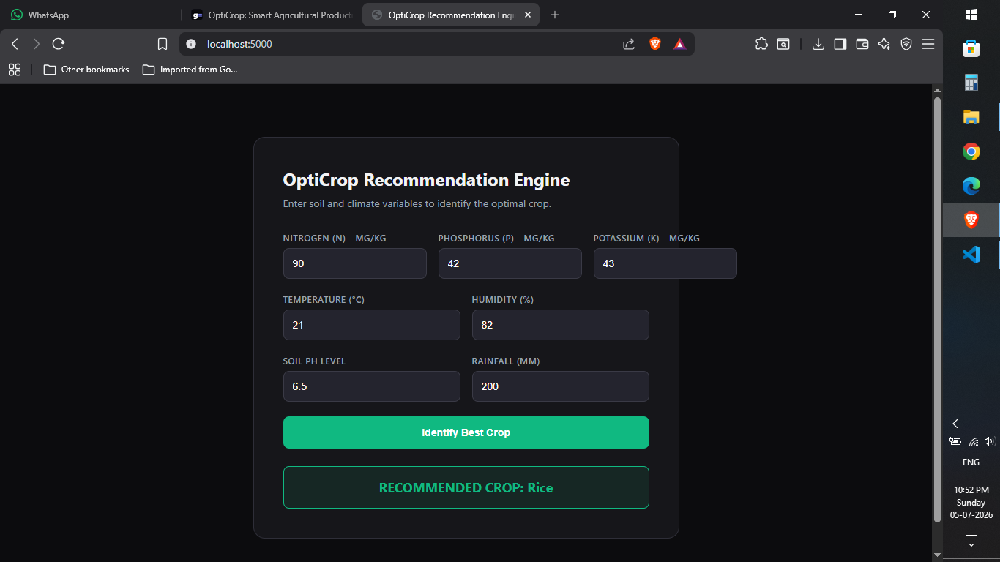

### `README.md`

markdown
# 🌱 OptiCrop: Smart Agricultural Production Optimization Engine
```
OptiCrop is an end-to-end, production-grade machine learning application designed to maximize agricultural resource efficiency and crop yield. By analyzing key soil nutrient metrics and ambient environmental factors, OptiCrop removes historical agricultural guesswork and accurately identifies the optimal, highest-yielding crop for any given plot of land.

The predictive core leverages a highly tuned **Random Forest Classifier** that achieves a stellar **99.55% validation accuracy** across 22 distinct crop varieties.
```
---

## 🏗️ System Architecture & Data Flow

OptiCrop uses a structured **Client-Server Architecture** designed with a strict **Separation of Concerns** principle:


```

[ Crop_recommendation.csv ] (2,200 Historical Records)
                                      │
                                      ▼
[ train.py Pipeline ] ──► [ Data Cleaning & Outlier Removal ]
                                         │
                                        ▼
[ StandardScaler ] ──────► Prevents scale dominance (e.g., Rainfall vs pH)
│
▼
[ Model Evaluation Suite ] ──► Logistic Regression, KNN, Decision Tree, Random Forest
│
▼
[ Serialized Artifacts ] ──► Saves models/crop_model.joblib & models/scaler.joblib
│
▼
[ Flask API Backend ] ────► Serves app.py & enforces boundary validation checks
▲
│ (HTTP POST /predict with JSON Payload)
▼
[ Web UI Frontend ] ───────► Interactive Form Layout (HTML5 / CSS3 / Async JS Fetch)

```
---

## 📊 Dataset & Features Explained
```
The engine trains on a balanced dataset containing **2,200 historical crop records** (100 uniform samples per crop type). The system processes 7 core environmental features to establish predictions:
```
### Soil Nutrient Profiles
* **N (Nitrogen):** Leaf builder ratio in soil ($mg/kg$). *Target Bounds: 0 - 250*
* **P (Phosphorus):** Root maker & early flower stimulant ($mg/kg$). *Target Bounds: 0 - 250*
* **K (Potassium):** Plant defense & cellular water regulator ($mg/kg$). *Target Bounds: 0 - 300*

### Climate & Environmental Metrics
* **Temperature:** Ambient air temperature measured in Celsius (°C).
* **Humidity:** Relative atmospheric moisture percentage (%).
* **pH Level:** Soil acidity/alkalinity scale (*0.0 (acidic) to 14.0 (alkaline)*, where 7.0 is neutral).
* **Rainfall:** Total regional precipitation volume measured in millimeters ($mm$).

### Target Classes (22 Unique Crops)
`apple`, `banana`, `blackgram`, `chickpea`, `coconut`, `coffee`, `cotton`, `grapes`, `jute`, `kidneybeans`, `lentil`, `maize`, `mango`, `mothbeans`, `mungbean`, `muskmelon`, `orange`, `papaya`, `pigeonpeas`, `pomegranate`, `rice`, `watermelon`.
```
```
---

## 📈 Model Performance & Comparison
```
During execution, the training suite evaluates multiple classic supervised paradigms alongside an unsupervised baseline to verify clear topological patterns:
```
| Machine Learning Model | Test Accuracy | Status |
| :--- | :---: | :---: |
| **Random Forest Classifier** | **99.55%** | 🏆 **Selected Winner** |
| Decision Tree Classifier | 97.95% | Evaluated |
| K-Nearest Neighbors (KNN) | 97.95% | Evaluated |
| Logistic Regression | 97.27% | Evaluated |

### Unsupervised Insight
* **K-Means Clustering** ($K=5$) is executed on scaled subsets to successfully extract macro regional climate structures automatically.
```
```
---

## 📂 Project Workspace Directory Structure

Maintain the following file distribution to ensure paths map seamlessly during execution:

```text
opticrop/
├── data/
│   └── Crop_recommendation.csv     # Raw tabular agricultural profile records
├── models/
│   ├── crop_model.joblib           # Serialized Winner: Random Forest Classifier weights
│   └── scaler.joblib               # Serialized feature normalization weights
├── templates/
│   └── index.html                  # Core application web UI structure layout
├── static/
│   ├── style.css                   # Custom midnight-ui dashboard theme styles
│   └── script.js                   # Asynchronous fetch client logic & client errors
├── notebook.ipynb                  # Interactive prototyping & Exploratory Data Analysis
├── train.py                        # Production-grade evaluation & serialization pipeline
└── app.py                          # Flask Web Server API backend gateway
```

---

## 🛠️ Local Installation & Environment Setup

### 1. Prerequisites

Ensure you have **Python 3.10+** and **Git** configured globally in your terminal environment.

### 2. Project Bootstrapping

Clone the workspace and navigate directly into the root directory:

```bash
git clone <your-repository-url>
cd opticrop

```

### 3. Dependencies Installation

Install the numeric computing, machine learning, and server libraries via `pip`:

```bash
pip install numpy pandas matplotlib seaborn scikit-learn joblib flask

```

---

## 🚀 Execution Guide

### Step 1: Execute the Training Pipeline

Run the underlying production script to ingest data, execute structural validations, resolve internal parameters, and serialize the weights:

```bash
python train.py

```

*Verification: Confirm that `models/crop_model.joblib` and `models/scaler.joblib` appear inside your workspace.*

### Step 2: Launch the Flask Server

Spin up the local microservices web instance gateway:

```bash
python app.py

```

*Terminal will report:* `* Running on http://127.0.0.1:5000`

### Step 3: Access the Application Portal

Open your modern web browser and navigate directly to:

```text
http://localhost:5000

```

---

## 🧪 Manual Verification & Test Cases

Validate network request paths and backend validations using these two test cases:

### Case A: Optimal Rice Soil Profile (Expected Success Response)

* **Inputs:** `N=90`, `P=42`, `K=43`, `Temp=21`, `Humidity=82`, `pH=6.5`, `Rainfall=200`
* **Expected UI Output:** ✅ `RECOMMENDED CROP: Rice` (Rendered in a green success block).

### Case B: Boundary Defense Check (Expected Failure Response)

* **Inputs:** Change `pH` field to `15.0`.
* **Expected UI Output:** ❌ `Prediction Error: Soil pH must be between 0.0 and 14.0.` (Rendered in a red warning block, confirming that the pipeline successfully defended the classifier from bad input ranges).

---

## 📡 Troubleshooting Port & Template Conflicts

* **Port 5000 Conflict (`OSError: Address already in use`):**
If another system service (such as macOS AirPlay Server) occupies port 5000, open `app.py`, scroll to the absolute bottom line, and append an alternative port index:
```python
app.run(port=5001, debug=True)

```


Re-launch and point the web client to `http://localhost:5001`.
* **HTML Render Errors (`TemplateNotFound: index.html`):**
Ensure `index.html` resides explicitly inside the `templates/` subfolder. Flask utilizes Jinja2 lookups, which strictly fail if the layout template sits loose in the workspace root directory.

---

## 🔮 Future Roadmap Extensions

* **Feature Importance Map:** Integrate dynamic plotting modules to explicitly visualize which specific variable impacts unique crops the most.
* **Live Weather API Synchronization:** Hook up backend services directly to an active engine (like OpenWeatherMap API) to harvest localized ambient temperature and real-time precipitation estimates seamlessly.
* **Cloud Production Deployment:** Package the structural ecosystem into lightweight Docker container runtimes ready for deployment to secure hosting instances (like AWS ECS or Render).

---

## 🖥️ User Interface Preview

Below is a preview of the interactive dashboard where users input soil profiles and climatic metrics to receive real-time crop recommendations:



*Figure 1: Production UI showcasing successful prediction states and real-time input parameter validation banners.*

---