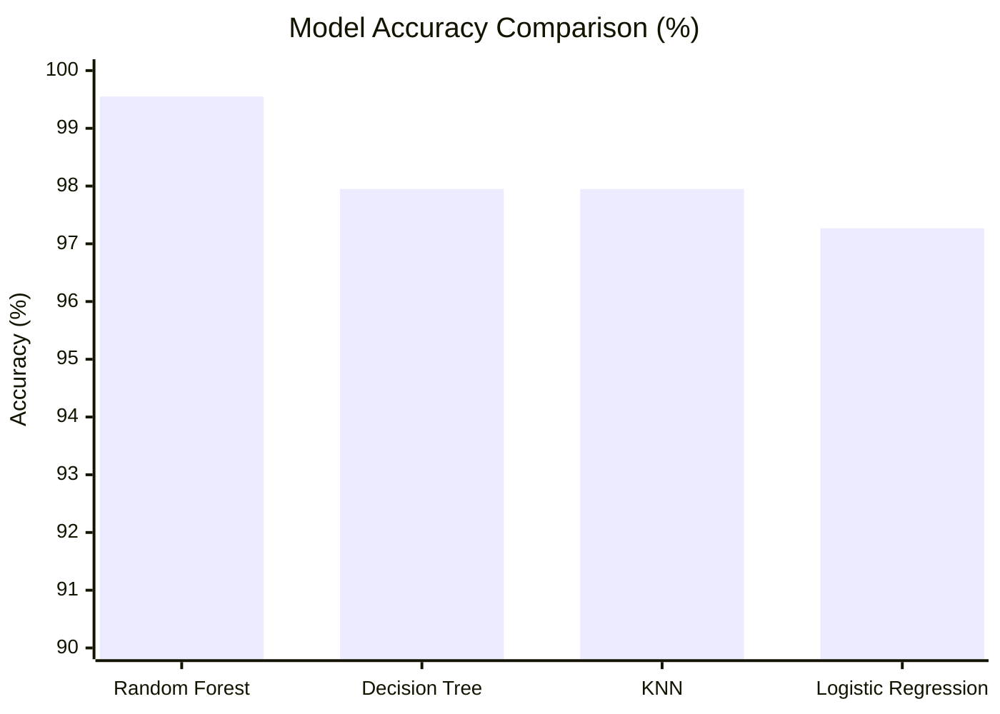
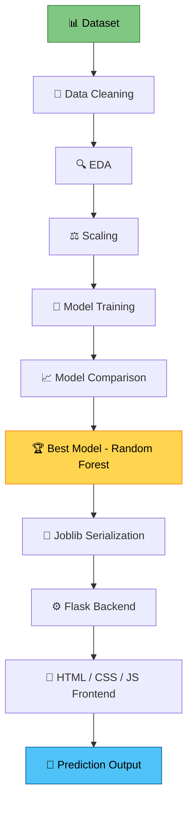
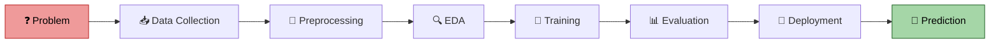

<div align="center">


# 🌱 OptiCrop
### Smart Agricultural Production Optimization Engine

**AI-Powered Crop Recommendation System for Data-Driven Farming**

[](https://www.python.org/)
[](https://flask.palletsprojects.com/)
[](https://scikit-learn.org/)
[](#-license)

[](https://github.com/srividyadasari5/opti-crop/stargazers)
[](https://github.com/srividyadasari5/opti-crop/network/members)
[](https://github.com/srividyadasari5/opti-crop/issues)
[](#)

<br/>

> 🌾 *"Empowering farmers with intelligent, data-driven crop decisions — one prediction at a time."*

</div>

---

## 📚 Table of Contents

- [🌟 Overview](#-overview)
- [🛠️ Tech Stack](#️-tech-stack)
- [📊 Dataset](#-dataset)
- [🤖 Model Comparison](#-model-comparison)
- [🗂️ Project Structure](#️-project-structure)
- [✨ Features](#-features)
- [🏗️ System Architecture](#️-system-architecture)
- [🔄 Project Workflow](#-project-workflow)
- [⚙️ Installation](#️-installation)
- [🖼️ Screenshots](#️-screenshots)
- [🔌 API Documentation](#-api-documentation)
- [🧪 Test Cases](#-test-cases)
- [🚀 Future Enhancements](#-future-enhancements)
- [👥 Team Members](#-team-members)
- [👨‍💻 Meet the Team](#-meet-the-team)
- [🙋 About My Contribution](#-about-my-contribution)
- [🎯 Use-Case Scenarios](#-use-case-scenarios)
- [📄 License](#-license)
- [❤️ Footer](#️-footer)

---

## 🌟 Overview

**OptiCrop** is an end-to-end **Machine Learning + Flask** web application that recommends the **best-suited crop** based on real-time soil nutrients and environmental conditions.

The system intelligently analyzes:

| 🌿 Parameter | Symbol | Description |
|:---|:---:|:---|
| Nitrogen | **N** | Soil nitrogen content |
| Phosphorous | **P** | Soil phosphorous content |
| Potassium | **K** | Soil potassium content |
| Temperature | **°C** | Ambient temperature |
| Humidity | **%** | Relative humidity |
| pH | **pH** | Soil acidity/alkalinity |
| Rainfall | **mm** | Rainfall levels |

...and predicts the most suitable crop out of **22 different crop varieties** 🌾🍚🌽🍇🍉.

> 💡 **Goal:** Improve agricultural productivity, minimize resource wastage, and enable smarter, sustainable farming through AI.

---

## 🛠️ Tech Stack

<div align="center">

### 🎨 Frontend


### ⚙️ Backend


### 🤖 Machine Learning


### 📦 Libraries


### 🧰 Tools


</div>

---

## 📊 Dataset

<div align="center">

| 📁 Attribute | 📌 Details |
|:---|:---|
| **Dataset Name** | `Crop_recommendation.csv` |
| **Total Records** | 2,200 |
| **Number of Classes** | 22 Crop Types 🌾 |
| **Features** | Nitrogen, Phosphorous, Potassium, Temperature, Humidity, pH, Rainfall |

</div>

<details>
<summary>📄 <b>Click to view sample feature schema</b></summary>

```json
{
  "N": 90,
  "P": 42,
  "K": 43,
  "temperature": 20.87,
  "humidity": 82.0,
  "ph": 6.5,
  "rainfall": 202.9,
  "label": "rice"
}
```

</details>

---

## 🤖 Model Comparison

> 🏆 Multiple ML algorithms were trained and benchmarked to select the **best-performing model**.

| 🔢 Model | 🎯 Accuracy | 📌 Status |
|:---|:---:|:---:|
| 🌳 **Random Forest** | **99.55%** | ✅ **Selected** |
| 🌲 Decision Tree | 97.95% | — |
| 📍 K-Nearest Neighbors (KNN) | 97.95% | — |
| 📈 Logistic Regression | 97.27% | — |
| 🔮 K-Means Clustering | Used for pattern analysis | Environmental Clustering |



> ⭐ **Random Forest** was selected as the final production model due to its superior accuracy and robustness against overfitting.

---

## 🗂️ Project Structure

```text
opti-crop/
├── 1. Brainstorming & Ideation/                    # Initial ideation and problem discovery
│   ├── Brainstorming & Idea Prioritization.pdf     # Brainstorming session and shortlisted ideas
│   ├── Define Problem Statements.pdf               # Clearly defined project problem statement
│   └── Empathy Map.pdf                             # User needs and pain point analysis
│
├── 2. Requirement Analysis/                        # Requirement gathering and analysis
│   ├── Customer Journey Map.pdf                    # End-user interaction workflow
│   ├── Data Flow Diagram.pdf                       # Data movement throughout the system
│   ├── Solution Architecture.pdf                   # High-level system architecture
│   └── Technology Stack.pdf                        # Technologies used in the project
│
├── 3. Project Design Phase/                        # Solution design documents
│   ├── Problem-Solution Fit.pdf                    # Mapping problems to proposed solutions
│   ├── Proposed Solution.pdf                       # Final solution design
│   └── Solution Architecture.pdf                   # Detailed architecture diagram
│
├── 4. Project Planning Phase/                      # Project planning and execution roadmap
│   └── Project Planning.pdf                        # Timeline, milestones, and planning
│
├── 5. Project Development Phase/                   # Source code and implementation
│   ├── .gitignore                                  # Git ignored files configuration
│   ├── Code-Layout, Readability and Reusability.pdf# Coding standards followed
│   ├── Coding & Solution.pdf                       # Implementation explanation
│   ├── No. of Functional Features Included in the Solution.pdf
│   ├── README.md                                   # Development phase documentation
│   ├── app.py                                      # Flask backend application
│   ├── train.py                                    # Model training and serialization script
│   ├── notebook.ipynb                              # EDA, preprocessing, and experiments
│   │
│   ├── assets/
│   │   └── user_interface.png                      # Application UI screenshot
│   │
│   ├── data/
│   │   └── Crop_recommendation.csv                 # Crop recommendation dataset
│   │
│   ├── templates/
│   │   └── index.html                              # Main HTML interface
│   │
│   └── static/
│       ├── style.css                               # Application styling
│       └── script.js                               # Frontend JavaScript logic
│
├── 6. Project Testing/                             # Testing reports
│   └── Performance Testing.pdf                     # Performance evaluation results
│
├── 7. Project Documentation/                       # Final project documentation
│   ├── OptiCrop Project Documentation.pdf          # Complete project report
│   └── Project Executable Files.pdf                # Execution and deployment guide
│
├── 8. Project Demonstration/                       # Demonstration artifacts
│   ├── Communication.pdf                           # Team communication strategy
│   ├── Demonstration of Proposed Features.pdf      # Feature demonstration
│   ├── Project Demo Planning.pdf                   # Demo presentation plan
│   ├── Scalability & Future Plan.pdf               # Future enhancements and scalability
│   └── Team Involvement in Demonstration.pdf       # Roles during demonstration
│
└── README.md                                       # Main repository documentation
```
---

## ✨ Features

<div align="center">

| | | |
|:---:|:---:|:---:|
| ✅ **Smart Crop Recommendation** | ✅ **Soil Analysis** | ✅ **Environmental Assessment** |
| ✅ **Machine Learning Prediction** | ✅ **Responsive Web Interface** | ✅ **Input Validation** |
| ✅ **Boundary Checking** | ✅ **Random Forest Prediction** | ✅ **Fast Flask Backend** |

</div>

> 🌟 Every feature is designed to deliver **accurate, real-time, and user-friendly** crop recommendations.

---

## 🏗️ System Architecture



---

## 🔄 Project Workflow



---

## ⚙️ Installation

> 🚀 Get **OptiCrop** running locally in just a few steps!

### 1️⃣ Clone the Repository

```bash
git clone https://github.com/srividyadasari5/opti-crop.git
```

### 2️⃣ Navigate to the Project Directory

```bash
cd OptiCrop
```

### 3️⃣ Install Dependencies

```bash
pip install -r requirements.txt
```

### 4️⃣ Train the Model

```bash
python train.py
```

### 5️⃣ Run the Flask Application

```bash
python app.py
```

<div align="center">

✅ **Now open** `http://127.0.0.1:5000/` **in your browser and start predicting!** 🌾

</div>

---

## 🖼️ Screenshots

<div align="center">

### 🖥️ Project UI


### 🌾 Prediction Result


### 📊 Training Output


</div>

---

## 🔌 API Documentation

### 📮 `POST /predict`

> Predicts the most suitable crop based on given soil and environmental parameters.

<details>
<summary>📤 <b>Request Example</b></summary>

```json
{
  "N": 90,
  "P": 42,
  "K": 43,
  "temperature": 20.87,
  "humidity": 82.0,
  "ph": 6.5,
  "rainfall": 202.9
}
```

</details>

<details>
<summary>📥 <b>Response Example</b></summary>

```json
{
  "status": "success",
  "predicted_crop": "rice",
  "confidence": 0.98
}
```

</details>

| 🔑 Field | 📋 Type | 📝 Description |
|:---|:---:|:---|
| `N` | float | Nitrogen content in soil |
| `P` | float | Phosphorous content in soil |
| `K` | float | Potassium content in soil |
| `temperature` | float | Temperature in °C |
| `humidity` | float | Relative humidity in % |
| `ph` | float | Soil pH value |
| `rainfall` | float | Rainfall in mm |

---

## 🧪 Test Cases

| 🧾 Input (N, P, K, Temp, Humidity, pH, Rainfall) | 🌾 Expected Crop | ✅ Status |
|:---|:---:|:---:|
| 90, 42, 43, 20.87, 82.0, 6.5, 202.9 | Rice | ✅ Pass |
| 71, 54, 16, 22.6, 63.6, 5.7, 87.7 | Maize | ✅ Pass |
| 20, 67, 20, 25.7, 16.9, 6.9, 60.8 | Chickpea | ✅ Pass |
| 118, 32, 47, 26.3, 51.9, 6.9, 68.5 | Cotton | ✅ Pass |
| 3, 63, 21, 27.7, 91.5, 6.0, 108.1 | Banana | ✅ Pass |

---

## 🚀 Future Enhancements

<div align="center">

| 🔮 Enhancement | 📌 Status |
|:---|:---:|
| 🌦 Real-time Weather API Integration | Planned |
| 🐳 Docker Containerization | Planned |
| ☁️ AWS Deployment | Planned |
| 🌐 Render Deployment | Planned |
| 🔐 User Authentication | Planned |
| 📜 Farmer Prediction History | Planned |
| 🌍 Multi-language Support | Planned |
| 📊 Feature Importance Visualization | Planned |

</div>

---

## 👥 Team Members

<div align="center">

| 👤 Name | 🎖️ Role |
|:---|:---:|
| **Dasari Srividya** | 👑 Team Lead |
| **Devarakonda Revathi** | 🧑‍💻 Member |
| **Idamakanti Anusha** | 🧑‍💻 Member |
| **Chokkani Ekshith** | 🧑‍💻 Member |
| **Shaik Khaadar Vali** | 🧑‍💻 Member |

</div>

---

## 👨‍💻 Meet the Team

> This project stands as a testament to the power of **collaborative innovation**. Each team member brought a unique blend of skills — from data engineering and model development to frontend design and quality assurance — coming together seamlessly to transform an idea into a fully functioning, production-ready application. The synergy, dedication, and consistent problem-solving spirit shown throughout this project reflect the strength of great teamwork. Together, the team didn't just build a machine learning model — they built a solution with real-world impact for the agricultural community. 🌾💚

---

## 🙋 About My Contribution

> As a core contributor to **OptiCrop**, **Chokkani Ekshith** played a significant role across multiple stages of the project lifecycle, including:

- 🧠 Designing and implementing the **Machine Learning pipeline**
- 📊 Conducting thorough **model evaluation** and performance benchmarking
- ⚙️ Developing the **Flask backend** for serving predictions
- 🎨 Handling **frontend integration** for a seamless user experience
- 📘 Authoring comprehensive **project documentation**
- 🧪 Performing rigorous **testing** to ensure reliability
- 🗂️ Managing the **GitHub repository**, including version control and collaboration workflows

> This contribution reflects a strong commitment to delivering a robust, well-documented, and maintainable end-to-end machine learning application.

---

## 🎯 Use-Case Scenarios

<table>
<tr>
<td width="33%" align="center">

### 🌾
**Farmer Crop Recommendation**

Helps farmers choose the most suitable crop based on their soil and climate conditions.

</td>
<td width="33%" align="center">

### 🌦
**Crop Suitability Analysis**

Assesses environmental compatibility for specific crop cultivation.

</td>
<td width="33%" align="center">

### 📊
**Agricultural Research**

Supports researchers with data-driven insights into crop-environment relationships.

</td>
</tr>
</table>

---

## 📄 License

<div align="center">

This project is licensed under the **MIT License**.

[](https://opensource.org/licenses/MIT)

```
MIT License © 2025 OptiCrop Team
Permission is hereby granted, free of charge, to any person obtaining a copy
of this software and associated documentation files to deal in the Software
without restriction, subject to the conditions of the MIT License.
```

</div>

---

## ❤️ Footer

<div align="center">

### ⭐ If you like this project, don't forget to give it a **Star**!

[](https://github.com/srividyadasari5/opti-crop)

🌱 **Made with ❤️ for Sustainable Agriculture** 🌍

<sub>Built by passionate developers striving for a greener, smarter tomorrow.</sub>

</div>
---

## 👨‍💻 Team Members

<div align="center">

<a href="https://github.com/srividyadasari5" style="text-decoration:none;">
    <br>
    <b>Dasari Srividya</b>
</a>

<br><br>

<a href="https://github.com/revathidevarakonda532-collab" style="text-decoration:none;">
    <br>
    <b>Devarakonda Revathi</b>
</a>

<br><br>

<a href="https://github.com/YOUR_USERNAME" style="text-decoration:none;">
    <br>
    <b>Idamakanti Anusha</b>
</a>

<br><br>

<a href="https://github.com/chEkshith" style="text-decoration:none;">
    <br>
    <b>Chokkani Ekshith</b>
</a>

<br><br>

<a href="https://github.com/khaadar4783" style="text-decoration:none;">
    <br>
    <b>Shaik Khaadar Vali</b>
</a>

</div>
